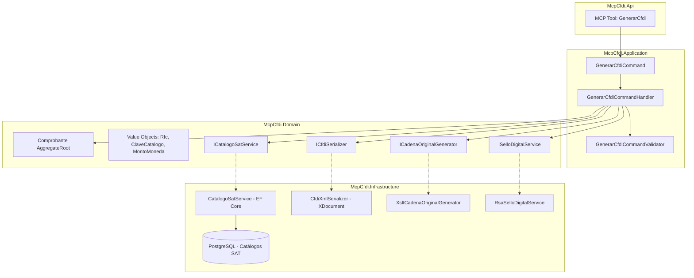
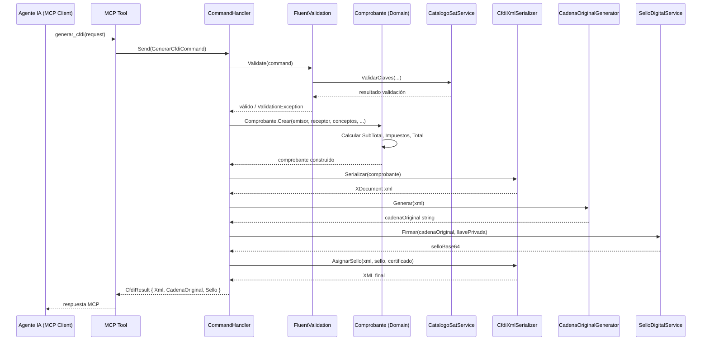
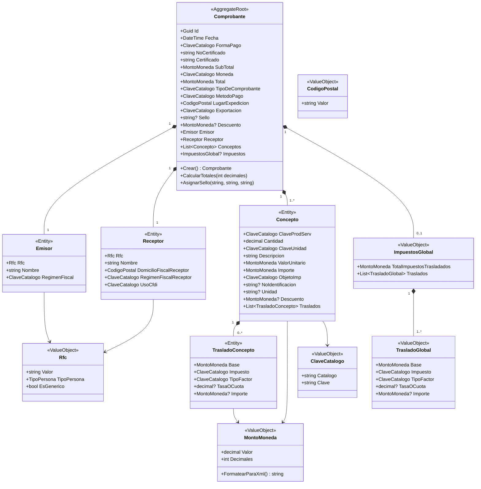
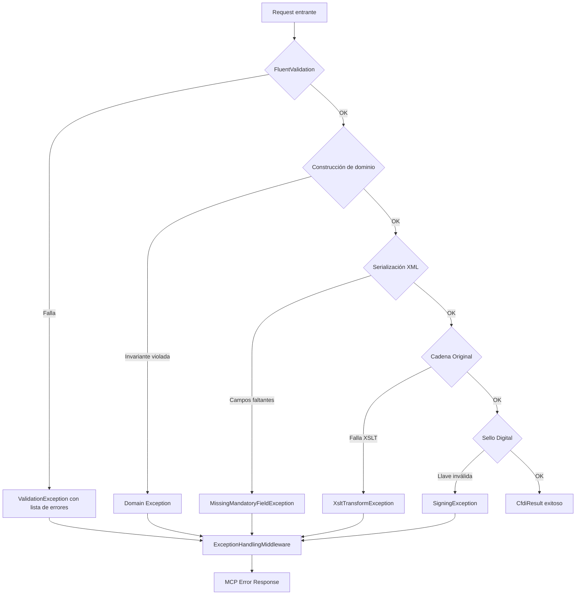

# Documento de Diseño Técnico — Generación de CFDI

## Overview

Este documento describe la arquitectura y diseño técnico para la generación de CFDI (Comprobante Fiscal Digital por Internet) versión 4.0, conforme al Anexo 20 del SAT. El sistema construye un modelo de dominio rico que representa un comprobante fiscal, lo valida contra los catálogos oficiales del SAT, lo serializa a XML conforme al esquema XSD, genera la cadena original vía XSLT y produce el sello digital con SHA-256/RSA.

El diseño se integra con la arquitectura limpia existente (Domain → Application → Infrastructure → Api) y expone la funcionalidad como herramienta MCP (Model Context Protocol) para que un agente de IA pueda generar CFDIs programáticamente.

### Decisiones clave de diseño

| Decisión | Justificación |
|----------|---------------|
| `Comprobante` como Aggregate Root | Es la unidad de consistencia transaccional — ninguna parte del CFDI tiene sentido fuera de su comprobante |
| Value Objects para RFC, claves de catálogo y montos | Inmutabilidad + validación en construcción = invalid state irrepresentable |
| `System.Xml.Linq` (XElement/XDocument) para serialización | Control fino sobre namespaces, orden de atributos y omisión de opcionales vs XmlSerializer que requiere clases decoradas |
| XSLT embebido como recurso para cadena original | La transformación oficial del SAT no cambia con frecuencia y embebida evita dependencia de I/O en runtime |
| Servicio de catálogos como interfaz en Application | Permite inyectar implementación en memoria para tests y EF Core en producción |
| Redondeo MidpointRounding.AwayFromZero | Es el "redondeo aritmético" (half-up) que requiere el Anexo 20 |

---

## Architecture



### Flujo de ejecución



---

## Components and Interfaces

### Capa de Dominio (`McpCfdi.Domain`)

#### Aggregate Root

```csharp
public class Comprobante : AggregateRoot<Guid>
{
    // Atributos obligatorios del nodo raíz
    public DateTime Fecha { get; private set; }
    public ClaveCatalogo FormaPago { get; private set; }
    public string NoCertificado { get; private set; }
    public string Certificado { get; private set; }
    public MontoMoneda SubTotal { get; private set; }
    public ClaveCatalogo Moneda { get; private set; }
    public MontoMoneda Total { get; private set; }
    public ClaveCatalogo TipoDeComprobante { get; private set; }
    public ClaveCatalogo MetodoPago { get; private set; }
    public CodigoPostal LugarExpedicion { get; private set; }
    public ClaveCatalogo Exportacion { get; private set; }
    public string? Sello { get; private set; }

    // Atributos opcionales
    public MontoMoneda? Descuento { get; private set; }

    // Entidades hijas
    public Emisor Emisor { get; private set; }
    public Receptor Receptor { get; private set; }
    private readonly List<Concepto> _conceptos = [];
    public IReadOnlyList<Concepto> Conceptos => _conceptos.AsReadOnly();
    public ImpuestosGlobal? Impuestos { get; private set; }

    // Factory method
    public static Comprobante Crear(/* parámetros */) { ... }
    public void CalcularTotales(int decimalesMoneda) { ... }
    public void AsignarSello(string sello, string certificado, string noCertificado) { ... }
}
```

#### Entidades

```csharp
public class Emisor : Entity<Guid>
{
    public Rfc Rfc { get; private set; }
    public string Nombre { get; private set; }
    public ClaveCatalogo RegimenFiscal { get; private set; }
}

public class Receptor : Entity<Guid>
{
    public Rfc Rfc { get; private set; }
    public string Nombre { get; private set; }
    public CodigoPostal DomicilioFiscalReceptor { get; private set; }
    public ClaveCatalogo RegimenFiscalReceptor { get; private set; }
    public ClaveCatalogo UsoCfdi { get; private set; }
}

public class Concepto : Entity<Guid>
{
    public ClaveCatalogo ClaveProdServ { get; private set; }
    public decimal Cantidad { get; private set; }
    public ClaveCatalogo ClaveUnidad { get; private set; }
    public string Descripcion { get; private set; }
    public MontoMoneda ValorUnitario { get; private set; }
    public MontoMoneda Importe { get; private set; }
    public ClaveCatalogo ObjetoImp { get; private set; }
    public string? NoIdentificacion { get; private set; }
    public string? Unidad { get; private set; }
    public MontoMoneda? Descuento { get; private set; }
    private readonly List<TrasladoConcepto> _traslados = [];
    public IReadOnlyList<TrasladoConcepto> Traslados => _traslados.AsReadOnly();
}

public class TrasladoConcepto : Entity<Guid>
{
    public MontoMoneda Base { get; private set; }
    public ClaveCatalogo Impuesto { get; private set; }
    public ClaveCatalogo TipoFactor { get; private set; }
    public decimal? TasaOCuota { get; private set; }
    public MontoMoneda? Importe { get; private set; }
}
```

#### Interfaces de dominio (puertos)

```csharp
public interface ICatalogoSatService
{
    Task<bool> ExisteClaveAsync(string catalogo, string clave, DateTime? fechaEmision = null, CancellationToken ct = default);
    Task<CatalogoValidationResult> ValidarClavesAsync(IEnumerable<CatalogoValidationRequest> requests, DateTime fechaEmision, CancellationToken ct = default);
    Task<int> ObtenerDecimalesMonedaAsync(string claveMoneda, CancellationToken ct = default);
}

public interface ICfdiSerializer
{
    XDocument Serializar(Comprobante comprobante);
    Comprobante Deserializar(XDocument xml);
    string SerializarAString(Comprobante comprobante);
}

public interface ICadenaOriginalGenerator
{
    string Generar(XDocument cfdiXml);
}

public interface ISelloDigitalService
{
    string Firmar(string cadenaOriginal, byte[] llavePrivadaDer, string? passwordLlave);
    string ObtenerNoCertificado(byte[] certificadoDer);
    string ObtenerCertificadoBase64(byte[] certificadoDer);
}
```

### Capa de Aplicación (`McpCfdi.Application`)

#### Command

```csharp
public record GenerarCfdiCommand : IRequest<CfdiResult>
{
    public required EmisorDto Emisor { get; init; }
    public required ReceptorDto Receptor { get; init; }
    public required IReadOnlyList<ConceptoDto> Conceptos { get; init; }
    public required string FormaPago { get; init; }
    public required string MetodoPago { get; init; }
    public required string Moneda { get; init; }
    public required string LugarExpedicion { get; init; }
    public required string Exportacion { get; init; }
    public DateTime? Fecha { get; init; }
    public byte[]? LlavePrivadaDer { get; init; }
    public string? PasswordLlave { get; init; }
    public byte[]? CertificadoDer { get; init; }
}
```

#### DTOs

```csharp
public record EmisorDto(string Rfc, string Nombre, string RegimenFiscal);
public record ReceptorDto(string Rfc, string Nombre, string DomicilioFiscalReceptor, string RegimenFiscalReceptor, string UsoCfdi);
public record ConceptoDto(
    string ClaveProdServ, decimal Cantidad, string ClaveUnidad,
    string Descripcion, decimal ValorUnitario, string ObjetoImp,
    string? NoIdentificacion = null, string? Unidad = null,
    decimal? Descuento = null, IReadOnlyList<TrasladoDto>? Traslados = null);
public record TrasladoDto(string Impuesto, string TipoFactor, decimal? TasaOCuota);
public record CfdiResult(string Xml, string CadenaOriginal, string Sello, Guid ComprobanteId);
```

#### Validator (FluentValidation)

```csharp
public class GenerarCfdiCommandValidator : AbstractValidator<GenerarCfdiCommand>
{
    public GenerarCfdiCommandValidator(ICatalogoSatService catalogos)
    {
        // Valida estructura RFC, catálogos, rangos numéricos, longitudes
        // Usa ICatalogoSatService para validar claves contra catálogos vigentes
    }
}
```

### Capa de Infraestructura (`McpCfdi.Infrastructure`)

| Componente | Implementa | Responsabilidad |
|------------|-----------|-----------------|
| `CatalogoSatService` | `ICatalogoSatService` | Consulta tablas de catálogos en PostgreSQL vía EF Core |
| `CfdiXmlSerializer` | `ICfdiSerializer` | Construye XDocument con namespaces, orden XSD, formateo numérico |
| `XsltCadenaOriginalGenerator` | `ICadenaOriginalGenerator` | Aplica `cadenaoriginal_4_0.xslt` embebido |
| `RsaSelloDigitalService` | `ISelloDigitalService` | SHA-256 + RSA + Base64 usando `System.Security.Cryptography` |

### Capa de API (`McpCfdi.Api`)

```csharp
[McpServerTool, Description("Genera un CFDI 4.0 válido conforme al Anexo 20 del SAT")]
public class GenerarCfdiTool
{
    private readonly ISender _mediator;

    public GenerarCfdiTool(ISender mediator) => _mediator = mediator;

    [McpServerTool("generar_cfdi")]
    public async Task<CfdiResult> GenerarAsync(GenerarCfdiCommand command, CancellationToken ct)
        => await _mediator.Send(command, ct);
}
```

---

## Data Models

### Value Objects

```csharp
/// <summary>
/// RFC (Registro Federal de Contribuyentes) con validación según reglas del SAT.
/// Personas morales: 12 caracteres. Personas físicas: 13 caracteres.
/// Admite RFC genéricos: XAXX010101000 (público general), XEXX010101000 (extranjeros).
/// </summary>
public sealed record Rfc
{
    private static readonly Regex PersonaMoralRegex = new(
        @"^[A-ZÑ&]{3}\d{6}[A-Z0-9]{3}$", RegexOptions.Compiled);
    private static readonly Regex PersonaFisicaRegex = new(
        @"^[A-ZÑ&]{4}\d{6}[A-Z0-9]{3}$", RegexOptions.Compiled);
    private static readonly HashSet<string> RfcGenericos = new()
    {
        "XAXX010101000", "XEXX010101000"
    };

    public string Valor { get; }
    public TipoPersona TipoPersona { get; }

    public Rfc(string valor) { /* validación + asignación */ }

    public bool EsGenerico => RfcGenericos.Contains(Valor);
}

public enum TipoPersona { Fisica, Moral, Generico }
```

```csharp
/// <summary>
/// Clave de un catálogo SAT. Valida formato no vacío.
/// La validación de existencia en catálogo se hace vía ICatalogoSatService.
/// </summary>
public sealed record ClaveCatalogo
{
    public string Catalogo { get; }
    public string Clave { get; }

    public ClaveCatalogo(string catalogo, string clave) { /* validación no vacío */ }
}
```

```csharp
/// <summary>
/// Monto monetario con redondeo conforme a decimales de la moneda SAT.
/// Extiende Money existente agregando redondeo currency-aware.
/// </summary>
public sealed record MontoMoneda
{
    public decimal Valor { get; }
    public int Decimales { get; }

    public MontoMoneda(decimal valor, int decimales)
    {
        Decimales = decimales;
        Valor = Math.Round(valor, decimales, MidpointRounding.AwayFromZero);
    }

    public static MontoMoneda operator +(MontoMoneda a, MontoMoneda b)
    {
        if (a.Decimales != b.Decimales)
            throw new InvalidOperationException("No se pueden sumar montos con diferente precisión decimal.");
        return new MontoMoneda(a.Valor + b.Valor, a.Decimales);
    }

    public static MontoMoneda operator *(MontoMoneda monto, decimal factor)
        => new(monto.Valor * factor, monto.Decimales);

    public string FormatearParaXml() => Valor.ToString($"F{Decimales}");
}
```

```csharp
/// <summary>
/// Código postal de 5 dígitos numéricos.
/// </summary>
public sealed record CodigoPostal
{
    private static readonly Regex Regex = new(@"^\d{5}$", RegexOptions.Compiled);
    public string Valor { get; }

    public CodigoPostal(string valor)
    {
        if (!Regex.IsMatch(valor))
            throw new ArgumentException("El código postal debe ser exactamente 5 dígitos numéricos.", nameof(valor));
        Valor = valor;
    }
}
```

### Modelo de persistencia de catálogos

```csharp
public class CatalogoEntry
{
    public int Id { get; set; }
    public string NombreCatalogo { get; set; } = default!;  // ej: "c_RegimenFiscal"
    public string Clave { get; set; } = default!;            // ej: "601"
    public string Descripcion { get; set; } = default!;
    public DateTime? FechaInicioVigencia { get; set; }
    public DateTime? FechaFinVigencia { get; set; }
    public string? Metadata { get; set; }  // JSON para campos adicionales (ej: aplicaPersonaFisica, aplicaPersonaMoral)
}
```

### Diagrama de dominio



---


## Correctness Properties

*Una propiedad es una característica o comportamiento que debe mantenerse verdadero a través de todas las ejecuciones válidas de un sistema — esencialmente, una declaración formal sobre lo que el sistema debe hacer. Las propiedades sirven como puente entre especificaciones legibles por humanos y garantías de correctitud verificables por máquina.*

### Property 1: Round-trip de serialización/deserialización

*Para cualquier* modelo de dominio `Comprobante` válido (con todos los campos obligatorios poblados y valores dentro de rangos legales), serializarlo a XML con el `Serializador_XML` y luego parsearlo de vuelta con el `Parser_XML` DEBERÁ producir un modelo equivalente campo por campo al original, incluyendo tanto atributos obligatorios como opcionales poblados.

**Validates: Requirements 9.1, 9.4, 9.5**

### Property 2: XML serializado contiene todos los elementos obligatorios

*Para cualquier* modelo de dominio `Comprobante` válido, la serialización DEBERÁ producir un documento XML donde el nodo raíz `Comprobante` con namespace `http://www.sat.gob.mx/cfd/4` contenga todos los atributos obligatorios (`Fecha`, `Sello`, `FormaPago`, `NoCertificado`, `Certificado`, `SubTotal`, `Moneda`, `Total`, `TipoDeComprobante`, `MetodoPago`, `LugarExpedicion`, `Exportacion`), y los nodos hijos `cfdi:Emisor` (con `Rfc`, `Nombre`, `RegimenFiscal`), `cfdi:Receptor` (con `Rfc`, `Nombre`, `DomicilioFiscalReceptor`, `RegimenFiscalReceptor`, `UsoCFDI`) y `cfdi:Conceptos` (con al menos un `cfdi:Concepto` con `ClaveProdServ`, `Cantidad`, `ClaveUnidad`, `Descripcion`, `ValorUnitario`, `Importe`, `ObjetoImp`).

**Validates: Requirements 1.1, 1.3, 2.1, 3.1, 4.2**

### Property 3: Importe de concepto = Cantidad × ValorUnitario redondeado

*Para cualquier* par de valores `Cantidad` (> 0, máx 6 decimales) y `ValorUnitario` (≥ 0) y *para cualquier* moneda con N decimales definidos, el `Importe` calculado DEBERÁ ser igual a `Math.Round(Cantidad * ValorUnitario, N, MidpointRounding.AwayFromZero)`. La misma fórmula aplica a nivel de traslado: `Importe` del traslado = `Math.Round(Base * TasaOCuota, N, MidpointRounding.AwayFromZero)`.

**Validates: Requirements 4.5, 5.5**

### Property 4: Totales globales de impuestos = suma de importes a nivel concepto

*Para cualquier* CFDI con M conceptos y cada concepto con K traslados, los totales del nodo global `cfdi:Impuestos` DEBERÁN satisfacer: (a) `TotalImpuestosTrasladados` = suma de todos los `Importe` de traslados a nivel concepto; (b) para cada combinación única de (`Impuesto`, `TipoFactor`, `TasaOCuota`), el `Importe` del traslado global = suma de importes del grupo, y la `Base` del traslado global = suma de bases del grupo, ambos redondeados a los decimales de la moneda.

**Validates: Requirements 6.5, 6.6, 6.7**

### Property 5: Fórmula de totales del comprobante

*Para cualquier* conjunto de conceptos con importes y descuentos, y *para cualquier* configuración de impuestos, los totales del nodo `Comprobante` DEBERÁN cumplir: `SubTotal` = Σ(Concepto.Importe); `Descuento` = Σ(Concepto.Descuento) cuando existan; `Total` = `SubTotal` − `Descuento` + `TotalImpuestosTrasladados` − `TotalImpuestosRetenidos`, donde cada componente se redondea al número de decimales de la moneda con redondeo half-up.

**Validates: Requirements 7.1, 7.2, 7.3**

### Property 6: Formateo numérico respeta decimales de la moneda

*Para cualquier* valor numérico monetario serializado en el XML de un CFDI cuya moneda define N decimales según el catálogo c_Moneda del SAT, la representación textual del valor DEBERÁ contener exactamente N dígitos después del punto decimal, sin ceros a la izquierda en la parte entera (excepto el caso de valor < 1).

**Validates: Requirements 7.6, 8.5**

### Property 7: TipoFactor determina conjunto de atributos del traslado

*Para cualquier* nodo `cfdi:Traslado` (tanto a nivel concepto como global), IF `TipoFactor` es "Tasa" o "Cuota" THEN el nodo DEBERÁ contener los atributos `Base`, `Impuesto`, `TipoFactor`, `TasaOCuota` e `Importe`; IF `TipoFactor` es "Exento" THEN el nodo DEBERÁ contener únicamente `Base`, `Impuesto` y `TipoFactor`, y los atributos `TasaOCuota` e `Importe` DEBERÁN estar ausentes del XML.

**Validates: Requirements 5.2, 5.3, 6.4**

### Property 8: Formato de la cadena original

*Para cualquier* CFDI válido serializado a XML, la cadena original generada por la transformación XSLT DEBERÁ: (a) iniciar con los caracteres `||`; (b) terminar con los caracteres `||`; (c) no contener retornos de carro (CR, `\r`); (d) no contener tabuladores (`\t`); (e) no contener dos o más espacios consecutivos.

**Validates: Requirements 10.2, 10.3**

### Property 9: Validación de estructura de RFC

*Para cualquier* cadena de entrada, el value object `Rfc` DEBERÁ aceptar únicamente cadenas que cumplan: (a) exactamente 12 caracteres con patrón `[A-ZÑ&]{3}\d{6}[A-Z0-9]{3}` para persona moral; (b) exactamente 13 caracteres con patrón `[A-ZÑ&]{4}\d{6}[A-Z0-9]{3}` para persona física; (c) los valores literales `XAXX010101000` o `XEXX010101000` para RFC genéricos. Cualquier otra cadena DEBERÁ ser rechazada.

**Validates: Requirements 2.2, 3.2**

### Property 10: Validación por lotes reporta todas las fallas

*Para cualquier* solicitud de generación de CFDI que contenga N claves de catálogo inválidas distribuidas en diferentes campos, el `Validador_CFDI` DEBERÁ evaluar la totalidad de las claves sin detenerse en la primera falla, y la respuesta de error DEBERÁ contener exactamente N entradas de error, cada una identificando el campo y catálogo correspondiente.

**Validates: Requirements 11.1, 11.2, 3.7, 4.10**

### Property 11: Validación de vigencia de claves de catálogo

*Para cualquier* entrada de catálogo con fechas de vigencia (`FechaInicioVigencia`, `FechaFinVigencia`) y *para cualquier* fecha de emisión del comprobante: la clave DEBERÁ ser aceptada si la fecha de emisión es ≥ `FechaInicioVigencia` (o inicio es null) Y ≤ `FechaFinVigencia` (o fin es null); DEBERÁ ser rechazada en caso contrario.

**Validates: Requirements 11.4**

### Property 12: Firma digital verificable con llave pública

*Para cualquier* cadena original y *para cualquier* par de llaves RSA válido (privada/pública), el sello digital producido por `ISelloDigitalService.Firmar(cadenaOriginal, llavePrivada)` DEBERÁ ser verificable positivamente usando el algoritmo SHA-256 con RSA y la llave pública correspondiente.

**Validates: Requirements 10.5**

### Property 13: ObjetoImp="02" implica existencia de nodo Impuestos

*Para cualquier* CFDI que contenga al menos un concepto con `ObjetoImp` = "02", el XML serializado DEBERÁ contener: (a) al menos un nodo `cfdi:Traslado` dentro del concepto correspondiente en `cfdi:Concepto/cfdi:Impuestos/cfdi:Traslados`; (b) el nodo `cfdi:Impuestos` a nivel raíz del comprobante. Inversamente, si ningún concepto tiene `ObjetoImp` = "02", el nodo `cfdi:Impuestos` a nivel raíz DEBERÁ estar ausente.

**Validates: Requirements 5.1, 6.1, 6.2**

### Property 14: Atributos opcionales ausentes se omiten del XML

*Para cualquier* modelo de dominio `Comprobante` donde un subconjunto de campos opcionales tenga valor null, el XML serializado NO DEBERÁ contener atributos correspondientes a esos campos nulos — no se generarán atributos vacíos ni con valor por defecto.

**Validates: Requirements 8.6**

### Property 15: Orden de nodos hijo conforme al XSD

*Para cualquier* CFDI serializado, los nodos hijo directos de `cfdi:Comprobante` DEBERÁN aparecer en el orden de secuencia definido por el esquema XSD: `cfdi:InformacionGlobal`, `cfdi:CfdiRelacionados`, `cfdi:Emisor`, `cfdi:Receptor`, `cfdi:Conceptos`, `cfdi:Impuestos`, `cfdi:Complemento`, `cfdi:Addenda` (omitiendo los que no estén presentes, pero sin alterar el orden relativo de los presentes).

**Validates: Requirements 8.8**

### Property 16: Formato de fecha sin zona horaria

*Para cualquier* valor de `DateTime` asignado al atributo `Fecha` del comprobante, la serialización DEBERÁ producir una cadena que coincida exactamente con el patrón `\d{4}-\d{2}-\d{2}T\d{2}:\d{2}:\d{2}` (formato `yyyy-MM-ddTHH:mm:ss`) sin indicador de zona horaria ni fracciones de segundo.

**Validates: Requirements 1.4**

---

## Error Handling

### Estrategia general

El sistema sigue un modelo de **fail-fast en validación, exhaustivo en reporte**:

1. **Validación FluentValidation** (pipeline MediatR): Captura errores de estructura, formato y catálogos **antes** de llegar al dominio. Acumula todas las fallas y las reporta como `ValidationException` con la lista completa.

2. **Domain exceptions**: El dominio lanza excepciones específicas cuando se violan invariantes (ej: `InvalidRfcException`, `ArithmeticMismatchException`).

3. **Infrastructure exceptions**: Envueltas en excepciones de aplicación con contexto (ej: `CatalogoUnavailableException` cuando PostgreSQL no responde).

### Tipos de error

| Capa | Excepción | Cuándo |
|------|-----------|--------|
| Domain | `InvalidRfcException` | RFC no cumple estructura SAT |
| Domain | `InvalidMontoException` | Valor monetario negativo o decimales excedidos |
| Domain | `MissingMandatoryFieldException` | Campo obligatorio null al construir entidad |
| Application | `CatalogValidationException` | Una o más claves de catálogo inválidas (incluye lista completa) |
| Application | `ArithmeticValidationException` | Discrepancia en cálculos (SubTotal, Total, Importe) |
| Infrastructure | `CatalogoUnavailableException` | No se pudo consultar catálogo SAT |
| Infrastructure | `XsltTransformException` | Falla en transformación XSLT |
| Infrastructure | `SigningException` | Error al firmar (llave inválida, formato incorrecto) |
| Infrastructure | `XmlParsingException` | XML malformado o namespace incorrecto |

### Respuesta MCP en caso de error

```json
{
  "isError": true,
  "content": [
    {
      "type": "text",
      "text": "Error de validación al generar CFDI:\n- Emisor.RegimenFiscal: clave '999' no existe en catálogo c_RegimenFiscal\n- Concepto[0].ClaveProdServ: clave '99999999' no existe en catálogo c_ClaveProdServ"
    }
  ]
}
```

### Flujo de errores



---

## Testing Strategy

### Enfoque dual

La estrategia combina **tests unitarios basados en ejemplo** para casos específicos y edge cases, con **tests basados en propiedades (PBT)** para verificar invariantes universales.

### Property-Based Testing

**Biblioteca**: [FsCheck](https://fscheck.github.io/FsCheck/) (v3.x) con xUnit como runner.

**Justificación**: FsCheck es la biblioteca PBT más madura para .NET, con soporte nativo para generadores de tipos complejos (records, colecciones, restricciones numéricas) y shrinking automático. Integra bien con xUnit que es el test runner estándar en .NET.

**Configuración**:
- Mínimo **100 iteraciones** por propiedad
- Cada test de propiedad referencia su propiedad del documento de diseño
- Tag format: `Feature: cfdi-generation, Property {N}: {título}`

### Generadores personalizados necesarios

| Generador | Produce | Restricciones |
|-----------|---------|---------------|
| `ArbRfc` | `Rfc` válido | 12 o 13 chars, patrón SAT |
| `ArbMontoMoneda` | `MontoMoneda` | ≥ 0, 0-6 decimales |
| `ArbCantidad` | `decimal` | > 0, máx 6 decimales |
| `ArbConcepto` | `Concepto` válido | Todos los campos dentro de rango |
| `ArbComprobante` | `Comprobante` completo | Aritméticamente consistente |
| `ArbTrasladoConcepto` | `TrasladoConcepto` | Base > 0, TipoFactor válido |
| `ArbCatalogoEntry` | `CatalogoEntry` | Con/sin fechas vigencia |

### Tests unitarios (ejemplo)

- Valores fijos de `Version="4.0"`
- XML sin declaración `<?xml?>`
- `xsi:schemaLocation` correcto
- Al menos un concepto requerido (lista vacía rechazada)
- RFC genéricos aceptados (`XAXX010101000`, `XEXX010101000`)
- `ObjetoImp` solo acepta "01", "02", "03"
- Catálogo indisponible produce error apropiado

### Tests de integración

- Validación XSD del XML generado contra `cfdv40.xsd` embebido
- Transformación XSLT real con `cadenaoriginal_4_0.xslt`
- Firma y verificación con certificados de prueba del SAT

### Mapeo Propiedades → Tests

| Propiedad | Test PBT | Generador principal |
|-----------|----------|---------------------|
| 1 (Round-trip) | `Serialize_Then_Parse_RoundTrip` | `ArbComprobante` |
| 2 (Mandatory elements) | `Serialized_Xml_Contains_All_Mandatory` | `ArbComprobante` |
| 3 (Importe = Qty × Price) | `Importe_Equals_Cantidad_Times_ValorUnitario` | `ArbCantidad`, `ArbMontoMoneda` |
| 4 (Global tax totals) | `Global_Tax_Equals_Sum_Of_Concept_Taxes` | `ArbComprobante` |
| 5 (Comprobante totals) | `Totals_Follow_Formula` | `ArbComprobante` |
| 6 (Decimal formatting) | `Numeric_Values_Have_Exact_Decimals` | `ArbMontoMoneda` |
| 7 (TipoFactor attrs) | `TipoFactor_Determines_Attribute_Set` | `ArbTrasladoConcepto` |
| 8 (Cadena original format) | `CadenaOriginal_Format_Invariants` | `ArbComprobante` |
| 9 (RFC validation) | `Rfc_Accepts_Only_Valid_Patterns` | `Arb<string>` |
| 10 (Bulk validation) | `Bulk_Validation_Reports_All_Failures` | `ArbComprobante` con claves inválidas |
| 11 (Vigencia dates) | `Vigencia_Date_Range_Validation` | `ArbCatalogoEntry`, `Arb<DateTime>` |
| 12 (Digital signature) | `Signature_Verifiable_With_Public_Key` | `Arb<string>` (cadenas), test RSA keys |
| 13 (ObjetoImp→Impuestos) | `ObjetoImp02_Implies_Tax_Node_Exists` | `ArbComprobante` |
| 14 (Optionals omitted) | `Null_Optionals_Absent_In_Xml` | `ArbComprobante` con opcionales aleatorios |
| 15 (Node order) | `Child_Nodes_Follow_Xsd_Sequence` | `ArbComprobante` |
| 16 (Fecha format) | `Fecha_Matches_DateTime_Pattern` | `Arb<DateTime>` |
