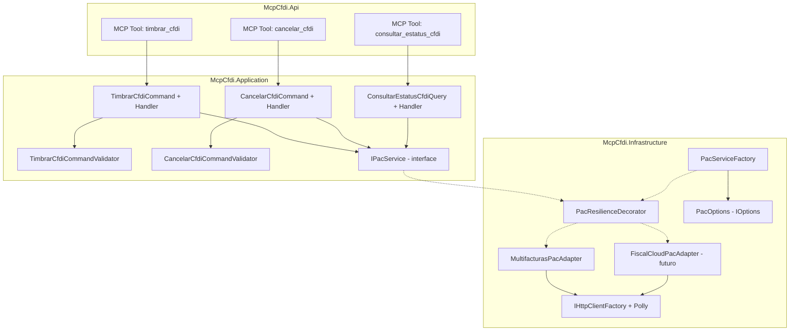
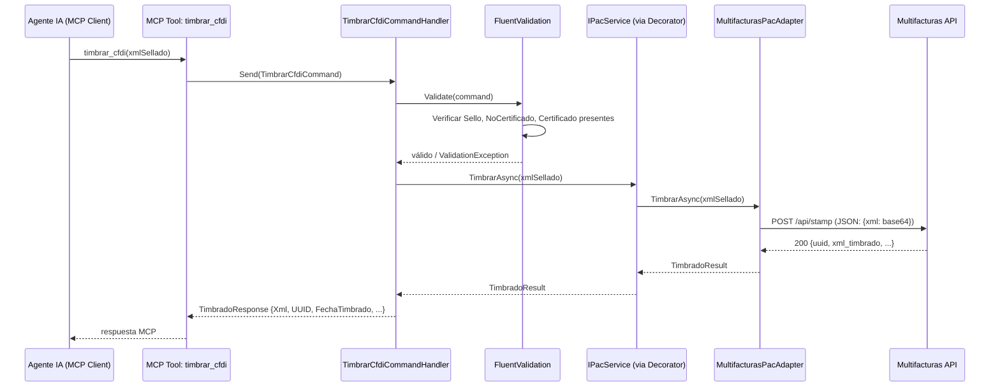
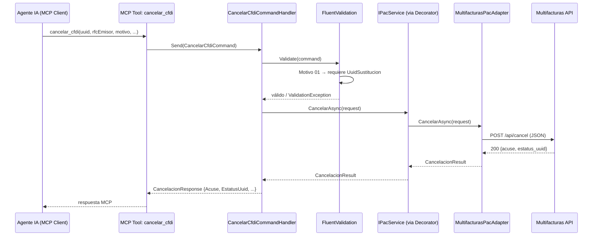
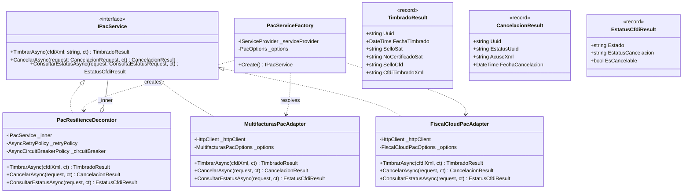
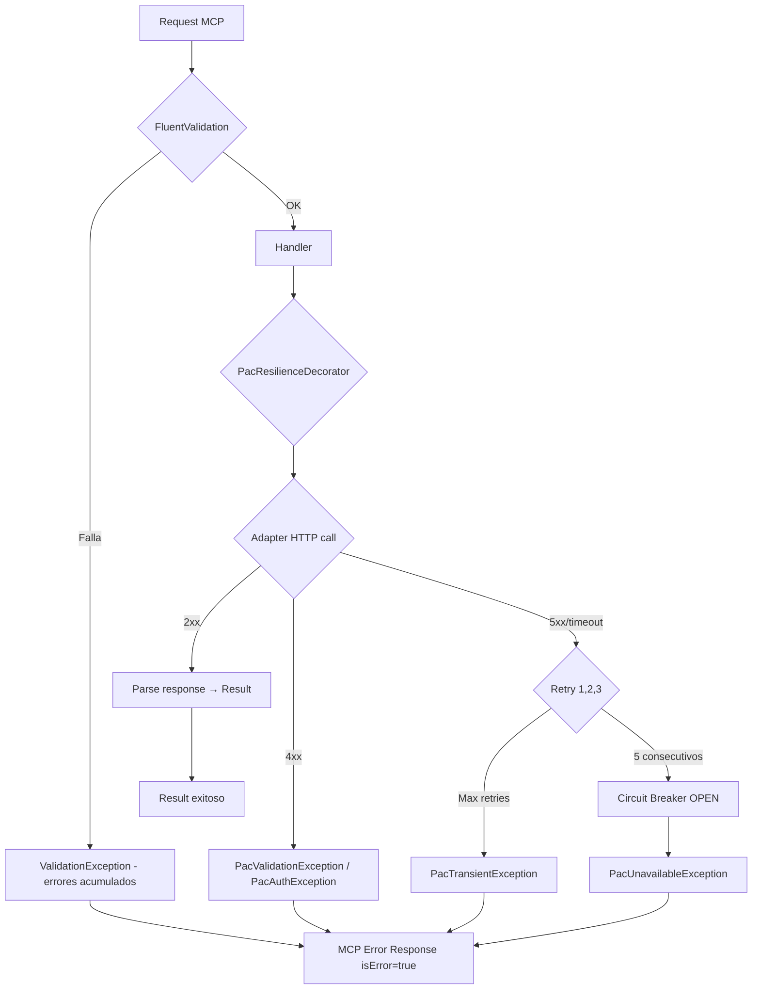

# Documento de Diseño Técnico — PAC Timbrado

## Overview

Este documento describe la arquitectura y diseño técnico para la integración con un Proveedor Autorizado de Certificación (PAC) para timbrar CFDIs pre-sellados, cancelar CFDIs timbrados y consultar su estatus ante el SAT.

El sistema recibe un XML de CFDI 4.0 ya firmado con el CSD del emisor (salida del feature `cfdi-generation`), lo envía al PAC activo para obtener el Timbre Fiscal Digital, y retorna el CFDI timbrado completo con UUID y sello del SAT.

La implementación inicial conecta con **Multifacturas** (API REST JSON, modelo prepago sin suscripción), pero la arquitectura permite intercambiar el PAC subyacente sin modificar lógica de negocio ni recompilar.

### Decisiones clave de diseño

| Decisión | Justificación |
|----------|---------------|
| `IPacService` como interfaz en Application | DIP — handlers dependen de abstracción; implementaciones concretas en Infrastructure |
| Strategy pattern para selección de PAC | Cambio de PAC vía configuración sin recompilar (OCP). Factory resuelve implementación por nombre |
| Decorator para resiliencia | Retry + circuit breaker envuelven `IPacService` sin modificar adaptadores (SRP, OCP) |
| Un Command/Query por operación | Consistente con CQRS existente. Cada operación tiene su validator independiente |
| Adaptador traduce errores PAC → excepciones de dominio | El handler nunca ve códigos HTTP ni formatos específicos del PAC (Adapter pattern) |
| Credenciales CSD como parámetros, no persistidas | Seguridad — llaves privadas solo existen en memoria durante la operación |
| `IHttpClientFactory` con Polly | Best practice .NET para HTTP resiliente sin socket exhaustion |

---

## Architecture



### Flujo de ejecución — Timbrado



### Flujo de ejecución — Cancelación



---

## Components and Interfaces

### Capa de Aplicación (`McpCfdi.Application`)

#### Interfaz del Puerto — IPacService

```csharp
/// <summary>
/// Puerto que abstrae las operaciones con un Proveedor Autorizado de Certificación (PAC).
/// La implementación concreta se selecciona por configuración (Strategy pattern).
/// </summary>
public interface IPacService
{
    /// <summary>
    /// Envía un CFDI pre-sellado al PAC para obtener el Timbre Fiscal Digital.
    /// </summary>
    /// <param name="cfdiXmlSellado">XML del CFDI 4.0 con Sello, NoCertificado y Certificado asignados.</param>
    /// <param name="ct">Token de cancelación.</param>
    /// <returns>Resultado con UUID, fecha de timbrado, sello SAT y XML timbrado completo.</returns>
    Task<TimbradoResult> TimbrarAsync(string cfdiXmlSellado, CancellationToken ct = default);

    /// <summary>
    /// Cancela un CFDI previamente timbrado ante el SAT.
    /// </summary>
    Task<CancelacionResult> CancelarAsync(CancelacionRequest request, CancellationToken ct = default);

    /// <summary>
    /// Consulta el estatus de un CFDI ante el SAT.
    /// </summary>
    Task<EstatusCfdiResult> ConsultarEstatusAsync(ConsultaEstatusRequest request, CancellationToken ct = default);
}
```

#### DTOs de resultado

```csharp
public record TimbradoResult(
    string Uuid,
    DateTime FechaTimbrado,
    string SelloSat,
    string NoCertificadoSat,
    string SelloCfd,
    string CfdiTimbradoXml);

public record CancelacionRequest(
    string Uuid,
    string RfcEmisor,
    string Motivo,
    string? UuidSustitucion,
    string? CertificadoBase64,
    string? LlavePrivadaBase64,
    string? PasswordLlave);

public record CancelacionResult(
    string Uuid,
    string EstatusUuid,
    string AcuseXml,
    DateTime FechaCancelacion);

public record ConsultaEstatusRequest(
    string RfcEmisor,
    string RfcReceptor,
    string Total,
    string Uuid);

public record EstatusCfdiResult(
    string Estado,
    string EstatusCancelacion,
    bool EsCancelable);
```

#### Commands y Queries

```csharp
public record TimbrarCfdiCommand : IRequest<TimbradoResult>
{
    /// <summary>XML del CFDI 4.0 pre-sellado (con Sello, NoCertificado, Certificado).</summary>
    public required string CfdiXmlSellado { get; init; }
}

public record CancelarCfdiCommand : IRequest<CancelacionResult>
{
    public required string Uuid { get; init; }
    public required string RfcEmisor { get; init; }
    public required string Motivo { get; init; }
    public string? UuidSustitucion { get; init; }
}

public record ConsultarEstatusCfdiQuery : IRequest<EstatusCfdiResult>
{
    public required string RfcEmisor { get; init; }
    public required string RfcReceptor { get; init; }
    public required string Total { get; init; }
    public required string Uuid { get; init; }
}
```

#### Validators (FluentValidation)

```csharp
public class TimbrarCfdiCommandValidator : AbstractValidator<TimbrarCfdiCommand>
{
    public TimbrarCfdiCommandValidator()
    {
        RuleFor(x => x.CfdiXmlSellado)
            .NotEmpty().WithMessage("El XML del CFDI es requerido.")
            .Must(ContenerAtributoSello).WithMessage("El XML debe contener el atributo Sello.")
            .Must(ContenerAtributoNoCertificado).WithMessage("El XML debe contener el atributo NoCertificado.")
            .Must(ContenerAtributoCertificado).WithMessage("El XML debe contener el atributo Certificado.");
    }

    private static bool ContenerAtributoSello(string xml) =>
        xml.Contains("Sello=\"") && !xml.Contains("Sello=\"\"");

    private static bool ContenerAtributoNoCertificado(string xml) =>
        xml.Contains("NoCertificado=\"") && !xml.Contains("NoCertificado=\"\"");

    private static bool ContenerAtributoCertificado(string xml) =>
        xml.Contains("Certificado=\"") && !xml.Contains("Certificado=\"\"");
}

public class CancelarCfdiCommandValidator : AbstractValidator<CancelarCfdiCommand>
{
    private static readonly HashSet<string> MotivosValidos = ["01", "02", "03", "04"];

    public CancelarCfdiCommandValidator()
    {
        RuleFor(x => x.Uuid).NotEmpty().Must(BeValidUuid)
            .WithMessage("UUID debe ser un GUID válido.");
        RuleFor(x => x.RfcEmisor).NotEmpty();
        RuleFor(x => x.Motivo).NotEmpty()
            .Must(m => MotivosValidos.Contains(m))
            .WithMessage("Motivo debe ser 01, 02, 03 o 04.");
        RuleFor(x => x.UuidSustitucion)
            .NotEmpty().When(x => x.Motivo == "01")
            .WithMessage("UUID de sustitución es obligatorio para motivo 01.")
            .Must(BeValidUuid!).When(x => x.UuidSustitucion is not null)
            .WithMessage("UUID de sustitución debe ser un GUID válido.");
    }

    private static bool BeValidUuid(string? value) =>
        Guid.TryParse(value, out _);
}
```

#### Handlers

```csharp
public class TimbrarCfdiCommandHandler : IRequestHandler<TimbrarCfdiCommand, TimbradoResult>
{
    private readonly IPacService _pacService;

    public TimbrarCfdiCommandHandler(IPacService pacService)
        => _pacService = pacService;

    public async Task<TimbradoResult> Handle(TimbrarCfdiCommand request, CancellationToken ct)
        => await _pacService.TimbrarAsync(request.CfdiXmlSellado, ct);
}

public class CancelarCfdiCommandHandler : IRequestHandler<CancelarCfdiCommand, CancelacionResult>
{
    private readonly IPacService _pacService;
    private readonly IEmisorCredencialesProvider _credencialesProvider;

    public CancelarCfdiCommandHandler(
        IPacService pacService,
        IEmisorCredencialesProvider credencialesProvider)
    {
        _pacService = pacService;
        _credencialesProvider = credencialesProvider;
    }

    public async Task<CancelacionResult> Handle(CancelarCfdiCommand request, CancellationToken ct)
    {
        // Cargar credenciales del emisor desde disco + env
        var credenciales = await _credencialesProvider.ObtenerCredencialesAsync(request.RfcEmisor, ct);

        var cancelacionRequest = new CancelacionRequest(
            Uuid: request.Uuid,
            RfcEmisor: request.RfcEmisor,
            Motivo: request.Motivo,
            UuidSustitucion: request.UuidSustitucion,
            CertificadoBase64: Convert.ToBase64String(credenciales.CertificadoDer),
            LlavePrivadaBase64: Convert.ToBase64String(credenciales.LlavePrivadaDer),
            PasswordLlave: credenciales.PasswordLlave);

        return await _pacService.CancelarAsync(cancelacionRequest, ct);
    }
}

public class ConsultarEstatusCfdiQueryHandler
    : IRequestHandler<ConsultarEstatusCfdiQuery, EstatusCfdiResult>
{
    private readonly IPacService _pacService;

    public ConsultarEstatusCfdiQueryHandler(IPacService pacService)
        => _pacService = pacService;

    public async Task<EstatusCfdiResult> Handle(
        ConsultarEstatusCfdiQuery request, CancellationToken ct)
    {
        var consultaRequest = new ConsultaEstatusRequest(
            RfcEmisor: request.RfcEmisor,
            RfcReceptor: request.RfcReceptor,
            Total: request.Total,
            Uuid: request.Uuid);

        return await _pacService.ConsultarEstatusAsync(consultaRequest, ct);
    }
}
```

### Capa de Infraestructura (`McpCfdi.Infrastructure`)

#### Configuración — PacOptions

```csharp
public class PacOptions
{
    public const string SectionName = "Pac";

    /// <summary>Nombre del PAC activo (debe coincidir con una sección hija).</summary>
    public string ActiveProvider { get; set; } = "Multifacturas";
    public MultifacturasPacOptions Multifacturas { get; set; } = new();
    public FiscalCloudPacOptions? FiscalCloud { get; set; }
}

public class MultifacturasPacOptions
{
    public string BaseUrl { get; set; } = "https://api.multifacturas.com";
    public string ApiKey { get; set; } = string.Empty;
    public string Usuario { get; set; } = string.Empty;
    public string Password { get; set; } = string.Empty;
    public int TimeoutSeconds { get; set; } = 30;
}

public class FiscalCloudPacOptions
{
    public string BaseUrl { get; set; } = "https://api.fiscalcloud.mx";
    public string ApiKey { get; set; } = string.Empty;
    public string Usuario { get; set; } = string.Empty;
    public string Password { get; set; } = string.Empty;
    public int TimeoutSeconds { get; set; } = 30;
}

/// <summary>
/// Configuración de emisores. Los certificados se cargan desde disco por RFC.
/// El password de la llave privada se recibe vía variable de entorno.
/// </summary>
public class EmisoresOptions
{
    public const string SectionName = "Emisores";

    /// <summary>Directorio base donde se almacenan los certificados por RFC.</summary>
    public string CertificadosDir { get; set; } = "./certs/cfdi";

    /// <summary>RFC del emisor por defecto (usado cuando no se especifica en el request).</summary>
    public string DefaultRfc { get; set; } = string.Empty;
}
```

#### Servicio de carga de credenciales del emisor

```csharp
/// <summary>
/// Carga las credenciales CSD de un emisor desde disco (certificado y llave)
/// y la contraseña desde variable de entorno.
/// 
/// Estructura esperada en disco:
///   {CertificadosDir}/{RFC}/certificado.cer
///   {CertificadosDir}/{RFC}/llave.key
///
/// Variable de entorno para password:
///   EMISOR__{RFC}__PASSWORD_LLAVE  (ej: EMISOR__EKU9003173C9__PASSWORD_LLAVE)
/// </summary>
public interface IEmisorCredencialesProvider
{
    /// <summary>Carga las credenciales CSD del emisor por RFC.</summary>
    Task<EmisorCredenciales> ObtenerCredencialesAsync(string rfc, CancellationToken ct = default);
    
    /// <summary>Verifica si existen credenciales configuradas para el RFC.</summary>
    bool ExistenCredenciales(string rfc);
}

public record EmisorCredenciales(
    string Rfc,
    byte[] CertificadoDer,
    byte[] LlavePrivadaDer,
    string PasswordLlave);

public class FileSystemEmisorCredencialesProvider : IEmisorCredencialesProvider
{
    private readonly EmisoresOptions _options;
    private readonly ILogger<FileSystemEmisorCredencialesProvider> _logger;

    public FileSystemEmisorCredencialesProvider(
        IOptions<EmisoresOptions> options,
        ILogger<FileSystemEmisorCredencialesProvider> logger)
    {
        _options = options.Value;
        _logger = logger;
    }

    public async Task<EmisorCredenciales> ObtenerCredencialesAsync(
        string rfc, CancellationToken ct = default)
    {
        var basePath = Path.Combine(_options.CertificadosDir, rfc);
        var cerPath = Path.Combine(basePath, "certificado.cer");
        var keyPath = Path.Combine(basePath, "llave.key");

        if (!File.Exists(cerPath))
            throw new EmisorCredencialesException(
                $"No se encontró el certificado para RFC {rfc} en: {cerPath}");
        if (!File.Exists(keyPath))
            throw new EmisorCredencialesException(
                $"No se encontró la llave privada para RFC {rfc} en: {keyPath}");

        // Password viene de variable de entorno: EMISOR__{RFC}__PASSWORD_LLAVE
        var envKey = $"EMISOR__{rfc}__PASSWORD_LLAVE";
        var password = Environment.GetEnvironmentVariable(envKey);
        if (string.IsNullOrEmpty(password))
            throw new EmisorCredencialesException(
                $"No se encontró la variable de entorno '{envKey}' con el password de la llave privada.");

        var certificado = await File.ReadAllBytesAsync(cerPath, ct);
        var llavePrivada = await File.ReadAllBytesAsync(keyPath, ct);

        _logger.LogDebug("Credenciales CSD cargadas para emisor {Rfc}", rfc);

        return new EmisorCredenciales(rfc, certificado, llavePrivada, password);
    }

    public bool ExistenCredenciales(string rfc)
    {
        var basePath = Path.Combine(_options.CertificadosDir, rfc);
        return File.Exists(Path.Combine(basePath, "certificado.cer"))
            && File.Exists(Path.Combine(basePath, "llave.key"));
    }
}
```

#### Factory — Resolución de PAC activo

```csharp
/// <summary>
/// Resuelve la implementación de IPacService según la configuración ActiveProvider.
/// Registrado como Singleton — el PAC activo se determina al iniciar la aplicación.
/// </summary>
public class PacServiceFactory
{
    private readonly IServiceProvider _serviceProvider;
    private readonly PacOptions _options;

    public PacServiceFactory(IServiceProvider serviceProvider, IOptions<PacOptions> options)
    {
        _serviceProvider = serviceProvider;
        _options = options.Value;
    }

    public IPacService Create()
    {
        var adapter = _options.ActiveProvider switch
        {
            "Multifacturas" => _serviceProvider.GetRequiredService<MultifacturasPacAdapter>(),
            "FiscalCloud" => _serviceProvider.GetRequiredService<FiscalCloudPacAdapter>(),
            _ => throw new InvalidOperationException(
                $"PAC provider '{_options.ActiveProvider}' no está registrado. " +
                $"Valores válidos: Multifacturas, FiscalCloud.")
        };

        // Wraps with resilience decorator
        return new PacResilienceDecorator(adapter, 
            _serviceProvider.GetRequiredService<ILogger<PacResilienceDecorator>>());
    }
}
```

#### Decorator — Resiliencia

```csharp
/// <summary>
/// Decorator que envuelve cualquier IPacService con retry y circuit breaker.
/// No conoce la implementación concreta del PAC — solo agrega resiliencia.
/// </summary>
public class PacResilienceDecorator : IPacService
{
    private readonly IPacService _inner;
    private readonly ILogger<PacResilienceDecorator> _logger;
    private readonly AsyncCircuitBreakerPolicy _circuitBreaker;
    private readonly AsyncRetryPolicy _retryPolicy;

    public PacResilienceDecorator(IPacService inner, ILogger<PacResilienceDecorator> logger)
    {
        _inner = inner;
        _logger = logger;

        _retryPolicy = Policy
            .Handle<PacTransientException>()
            .WaitAndRetryAsync(3, attempt =>
                TimeSpan.FromSeconds(Math.Pow(2, attempt)),
                (ex, delay, attempt, _) =>
                    _logger.LogWarning(ex,
                        "PAC retry {Attempt}/3 after {Delay}s", attempt, delay.TotalSeconds));

        _circuitBreaker = Policy
            .Handle<PacTransientException>()
            .CircuitBreakerAsync(5, TimeSpan.FromSeconds(30),
                onBreak: (ex, duration) =>
                    _logger.LogError(ex,
                        "PAC circuit breaker OPEN for {Duration}s", duration.TotalSeconds),
                onReset: () =>
                    _logger.LogInformation("PAC circuit breaker CLOSED"));
    }

    public async Task<TimbradoResult> TimbrarAsync(string cfdiXmlSellado, CancellationToken ct)
    {
        return await _retryPolicy.WrapAsync(_circuitBreaker)
            .ExecuteAsync(() => _inner.TimbrarAsync(cfdiXmlSellado, ct));
    }

    public async Task<CancelacionResult> CancelarAsync(
        CancelacionRequest request, CancellationToken ct)
    {
        return await _retryPolicy.WrapAsync(_circuitBreaker)
            .ExecuteAsync(() => _inner.CancelarAsync(request, ct));
    }

    public async Task<EstatusCfdiResult> ConsultarEstatusAsync(
        ConsultaEstatusRequest request, CancellationToken ct)
    {
        return await _retryPolicy.WrapAsync(_circuitBreaker)
            .ExecuteAsync(() => _inner.ConsultarEstatusAsync(request, ct));
    }
}
```

#### Adaptador — Multifacturas

```csharp
/// <summary>
/// Adaptador que traduce IPacService al API REST JSON de Multifacturas.
/// Usa IHttpClientFactory para manejo de conexiones y Polly para timeouts.
/// </summary>
public class MultifacturasPacAdapter : IPacService
{
    private readonly HttpClient _httpClient;
    private readonly MultifacturasPacOptions _options;
    private readonly ILogger<MultifacturasPacAdapter> _logger;

    public MultifacturasPacAdapter(
        HttpClient httpClient,
        IOptions<PacOptions> options,
        ILogger<MultifacturasPacAdapter> logger)
    {
        _httpClient = httpClient;
        _options = options.Value.Multifacturas;
        _logger = logger;
    }

    public async Task<TimbradoResult> TimbrarAsync(string cfdiXmlSellado, CancellationToken ct)
    {
        var requestBody = new
        {
            xml = Convert.ToBase64String(Encoding.UTF8.GetBytes(cfdiXmlSellado))
        };

        _logger.LogDebug("Enviando CFDI a timbrar a Multifacturas");

        var response = await _httpClient.PostAsJsonAsync("/api/stamp", requestBody, ct);

        return response.StatusCode switch
        {
            HttpStatusCode.OK => await ParseTimbradoResponse(response, ct),
            HttpStatusCode.BadRequest => throw await CreateValidationException(response, ct),
            HttpStatusCode.Unauthorized => throw new PacAuthenticationException(
                "Credenciales de Multifacturas inválidas o expiradas."),
            HttpStatusCode.PaymentRequired => throw new PacInsufficientCreditsException(
                "Saldo insuficiente de timbres en Multifacturas."),
            var status when (int)status >= 500 => throw new PacTransientException(
                $"Error del servidor de Multifacturas: {status}"),
            _ => throw new PacIntegrationException(
                $"Respuesta inesperada de Multifacturas: {response.StatusCode}")
        };
    }

    public async Task<CancelacionResult> CancelarAsync(
        CancelacionRequest request, CancellationToken ct)
    {
        var requestBody = new
        {
            uuid = request.Uuid,
            rfc = request.RfcEmisor,
            motivo = request.Motivo,
            folioSustitucion = request.UuidSustitucion ?? "",
            b64Cer = request.CertificadoBase64,
            b64Key = request.LlavePrivadaBase64,
            password = request.PasswordLlave
        };

        _logger.LogDebug("Enviando cancelación UUID {Uuid} a Multifacturas", request.Uuid);

        var response = await _httpClient.PostAsJsonAsync("/api/cancel", requestBody, ct);

        return response.StatusCode switch
        {
            HttpStatusCode.OK => await ParseCancelacionResponse(response, ct),
            HttpStatusCode.BadRequest => throw await CreateValidationException(response, ct),
            var status when (int)status >= 500 => throw new PacTransientException(
                $"Error del servidor de Multifacturas: {status}"),
            _ => throw new PacIntegrationException(
                $"Respuesta inesperada de Multifacturas: {response.StatusCode}")
        };
    }

    public async Task<EstatusCfdiResult> ConsultarEstatusAsync(
        ConsultaEstatusRequest request, CancellationToken ct)
    {
        var queryString = $"?rfcEmisor={request.RfcEmisor}" +
                         $"&rfcReceptor={request.RfcReceptor}" +
                         $"&total={request.Total}" +
                         $"&uuid={request.Uuid}";

        _logger.LogDebug("Consultando estatus UUID {Uuid} en Multifacturas", request.Uuid);

        var response = await _httpClient.GetAsync($"/api/status{queryString}", ct);

        return response.StatusCode switch
        {
            HttpStatusCode.OK => await ParseEstatusResponse(response, ct),
            var status when (int)status >= 500 => throw new PacTransientException(
                $"Error del servidor de Multifacturas: {status}"),
            _ => throw new PacIntegrationException(
                $"Respuesta inesperada de Multifacturas: {response.StatusCode}")
        };
    }

    // Métodos privados de parsing omitidos por brevedad — deserializan JSON a records
    private async Task<TimbradoResult> ParseTimbradoResponse(
        HttpResponseMessage response, CancellationToken ct) { /* ... */ }
    private async Task<CancelacionResult> ParseCancelacionResponse(
        HttpResponseMessage response, CancellationToken ct) { /* ... */ }
    private async Task<EstatusCfdiResult> ParseEstatusResponse(
        HttpResponseMessage response, CancellationToken ct) { /* ... */ }
    private async Task<PacValidationException> CreateValidationException(
        HttpResponseMessage response, CancellationToken ct) { /* ... */ }
}
```

#### Registro de DI — Composición

```csharp
// En Program.cs o una extensión de IServiceCollection
public static IServiceCollection AddPacServices(
    this IServiceCollection services, IConfiguration configuration)
{
    services.Configure<PacOptions>(configuration.GetSection(PacOptions.SectionName));
    services.Configure<EmisoresOptions>(configuration.GetSection(EmisoresOptions.SectionName));

    // Proveedor de credenciales del emisor (carga .cer/.key de disco, password de env)
    services.AddSingleton<IEmisorCredencialesProvider, FileSystemEmisorCredencialesProvider>();

    // Registro del HttpClient para Multifacturas con resiliencia base
    services.AddHttpClient<MultifacturasPacAdapter>((sp, client) =>
    {
        var options = sp.GetRequiredService<IOptions<PacOptions>>().Value.Multifacturas;
        client.BaseAddress = new Uri(options.BaseUrl);
        client.Timeout = TimeSpan.FromSeconds(options.TimeoutSeconds);
        client.DefaultRequestHeaders.Add("Authorization", $"Bearer {options.ApiKey}");
    });

    // Registro del HttpClient para FiscalCloud (futuro)
    services.AddHttpClient<FiscalCloudPacAdapter>((sp, client) =>
    {
        var options = sp.GetRequiredService<IOptions<PacOptions>>().Value.FiscalCloud;
        if (options is null) return;
        client.BaseAddress = new Uri(options.BaseUrl);
        client.Timeout = TimeSpan.FromSeconds(options.TimeoutSeconds);
        client.DefaultRequestHeaders.Add("Authorization", $"Bearer {options.ApiKey}");
    });

    // Factory + IPacService resolution
    services.AddSingleton<PacServiceFactory>();
    services.AddSingleton<IPacService>(sp => sp.GetRequiredService<PacServiceFactory>().Create());

    return services;
}
```

### Capa de API (`McpCfdi.Api`)

#### MCP Tools

```csharp
[McpServerTool, Description("Timbra un CFDI 4.0 pre-sellado ante el SAT vía PAC")]
public class TimbrarCfdiTool
{
    private readonly ISender _mediator;
    public TimbrarCfdiTool(ISender mediator) => _mediator = mediator;

    [McpServerTool("timbrar_cfdi")]
    [Description("Envía un XML de CFDI pre-sellado al PAC para obtener el Timbre Fiscal Digital (UUID).")]
    public async Task<TimbradoResult> TimbrarAsync(
        [Description("XML completo del CFDI 4.0 con atributos Sello, NoCertificado y Certificado ya asignados")]
        string cfdiXmlSellado,
        CancellationToken ct)
        => await _mediator.Send(new TimbrarCfdiCommand { CfdiXmlSellado = cfdiXmlSellado }, ct);
}

[McpServerTool, Description("Cancela un CFDI previamente timbrado ante el SAT")]
public class CancelarCfdiTool
{
    private readonly ISender _mediator;
    public CancelarCfdiTool(ISender mediator) => _mediator = mediator;

    [McpServerTool("cancelar_cfdi")]
    [Description("Cancela un CFDI timbrado. Requiere motivo (01-04). Las credenciales CSD se cargan automáticamente por RFC desde la configuración local.")]
    public async Task<CancelacionResult> CancelarAsync(
        [Description("UUID del CFDI a cancelar")] string uuid,
        [Description("RFC del emisor")] string rfcEmisor,
        [Description("Motivo: 01=con sustitución, 02=sin relación, 03=no realizada, 04=global")]
        string motivo,
        [Description("UUID del CFDI sustituto (obligatorio si motivo=01)")]
        string? uuidSustitucion,
        CancellationToken ct)
        => await _mediator.Send(new CancelarCfdiCommand
        {
            Uuid = uuid,
            RfcEmisor = rfcEmisor,
            Motivo = motivo,
            UuidSustitucion = uuidSustitucion
        }, ct);
}

[McpServerTool, Description("Consulta el estatus de un CFDI ante el SAT")]
public class ConsultarEstatusCfdiTool
{
    private readonly ISender _mediator;
    public ConsultarEstatusCfdiTool(ISender mediator) => _mediator = mediator;

    [McpServerTool("consultar_estatus_cfdi")]
    [Description("Consulta si un CFDI está Vigente, Cancelado o No encontrado.")]
    public async Task<EstatusCfdiResult> ConsultarAsync(
        [Description("RFC del emisor")] string rfcEmisor,
        [Description("RFC del receptor")] string rfcReceptor,
        [Description("Total del CFDI")] string total,
        [Description("UUID del CFDI")] string uuid,
        CancellationToken ct)
        => await _mediator.Send(new ConsultarEstatusCfdiQuery
        {
            RfcEmisor = rfcEmisor,
            RfcReceptor = rfcReceptor,
            Total = total,
            Uuid = uuid
        }, ct);
}
```

---

## Data Models

### Configuración (`appsettings.json`)

```json
{
  "Pac": {
    "ActiveProvider": "Multifacturas",
    "Multifacturas": {
      "BaseUrl": "https://api.multifacturas.com",
      "ApiKey": "YOUR_API_KEY_HERE",
      "Usuario": "",
      "Password": "",
      "TimeoutSeconds": 30
    },
    "FiscalCloud": {
      "BaseUrl": "https://api.fiscalcloud.mx",
      "ApiKey": "",
      "Usuario": "",
      "Password": "",
      "TimeoutSeconds": 30
    }
  },
  "Emisores": {
    "CertificadosDir": "./certs/cfdi",
    "DefaultRfc": "EKU9003173C9"
  }
}
```

### Configuración MCP Client (`mcp.json`)

> **Nota sobre ambiente de pruebas (Multifacturas):** Multifacturas ofrece un modo de pruebas para desarrollo, pero no publica un endpoint de sandbox separado en su documentación. Es necesario contactar a su soporte (WhatsApp 871 265 4009) para obtener credenciales de prueba y confirmar si usan un BaseUrl diferente o un flag en la cuenta. El diseño soporta esto via configuración — basta cambiar `BaseUrl` y `ApiKey` para alternar entre sandbox y producción.

El password de la llave privada del emisor se pasa como variable de entorno desde el MCP client. Los archivos .cer y .key viven en la carpeta local por RFC.

```json
{
  "mcpServers": {
    "mcp-cfdi": {
      "command": "dotnet",
      "args": ["run", "--project", "src/McpCfdi.Api"],
      "env": {
        "PAC__ACTIVEPROVIDER": "Multifacturas",
        "PAC__MULTIFACTURAS__APIKEY": "tu-api-key-de-multifacturas",
        "EMISORES__CERTIFICADOSDIR": "C:/Users/usuario/certs/cfdi",
        "EMISORES__DEFAULTRFC": "EKU9003173C9",
        "EMISOR__EKU9003173C9__PASSWORD_LLAVE": "12345678a"
      }
    }
  }
}
```

### Estructura de archivos del emisor en disco

```
{CertificadosDir}/
  EKU9003173C9/
    certificado.cer     ← .cer en formato DER
    llave.key           ← .key en formato DER (cifrada con password)
  OTRA_EMPRESA_RFC/
    certificado.cer
    llave.key
```

### Diagrama de clases



---

## Error Handling

### Jerarquía de excepciones PAC

```csharp
/// <summary>Base para todas las excepciones relacionadas con el PAC.</summary>
public abstract class PacException : Exception
{
    public string? PacProvider { get; init; }
    protected PacException(string message, Exception? inner = null) : base(message, inner) { }
}

/// <summary>Error transitorio del PAC (5xx, timeout) — se puede reintentar.</summary>
public class PacTransientException : PacException
{
    public PacTransientException(string message, Exception? inner = null)
        : base(message, inner) { }
}

/// <summary>Error de validación del PAC (4xx) — el XML o datos son inválidos.</summary>
public class PacValidationException : PacException
{
    public string? CodigoError { get; init; }
    public string? DetalleError { get; init; }
    public PacValidationException(string message, string? codigo = null, string? detalle = null)
        : base(message) { CodigoError = codigo; DetalleError = detalle; }
}

/// <summary>Credenciales del PAC inválidas o expiradas.</summary>
public class PacAuthenticationException : PacException
{
    public PacAuthenticationException(string message) : base(message) { }
}

/// <summary>Saldo insuficiente de timbres en el PAC.</summary>
public class PacInsufficientCreditsException : PacException
{
    public PacInsufficientCreditsException(string message) : base(message) { }
}

/// <summary>Error inesperado de integración con el PAC.</summary>
public class PacIntegrationException : PacException
{
    public PacIntegrationException(string message, Exception? inner = null)
        : base(message, inner) { }
}

/// <summary>Circuit breaker abierto — el PAC no está disponible temporalmente.</summary>
public class PacUnavailableException : PacException
{
    public PacUnavailableException(string message) : base(message) { }
}
```

### Mapeo a respuesta MCP

| Excepción | Mensaje MCP | Acción sugerida |
|-----------|-------------|-----------------|
| `PacValidationException` | Error del PAC + código + detalle | Corregir XML/datos |
| `PacAuthenticationException` | "Credenciales del PAC inválidas" | Verificar configuración |
| `PacInsufficientCreditsException` | "Saldo insuficiente de timbres" | Comprar más timbres |
| `PacTransientException` (tras 3 retries) | "PAC no disponible temporalmente" | Reintentar más tarde |
| `PacUnavailableException` | "Circuit breaker abierto" | Esperar 30 segundos |
| `ValidationException` (FluentValidation) | Lista de errores de validación | Corregir input |

### Flujo de errores



---

## Testing Strategy

### Enfoque

La estrategia de testing se centra en **tests de integración con WireMock** para verificar el comportamiento del adaptador contra respuestas simuladas del PAC, y **tests unitarios** para validators y decorator.

### Tests Unitarios

| Componente | Qué se prueba |
|------------|---------------|
| `TimbrarCfdiCommandValidator` | XML sin Sello rechazado, XML sin NoCertificado rechazado, XML válido aceptado |
| `CancelarCfdiCommandValidator` | Motivo inválido rechazado, motivo 01 sin sustitución rechazado, motivo 02 sin sustitución aceptado |
| `PacResilienceDecorator` | Retry en PacTransientException, no retry en PacValidationException, circuit breaker se abre tras 5 fallos |
| `PacServiceFactory` | Provider "Multifacturas" resuelve MultifacturasPacAdapter, provider desconocido lanza excepción |

### Tests de Integración (WireMock)

```csharp
public class MultifacturasPacAdapterTests : IClassFixture<WireMockFixture>
{
    [Fact]
    public async Task TimbrarAsync_ConXmlValido_RetornaUuidYXmlTimbrado()
    {
        // Arrange: WireMock devuelve respuesta exitosa de Multifacturas
        _wireMock.Given(Request.Create().WithPath("/api/stamp").UsingPost())
            .RespondWith(Response.Create()
                .WithStatusCode(200)
                .WithBody(/* JSON simulado de respuesta exitosa */));

        // Act
        var result = await _adapter.TimbrarAsync(CfdiXmlSellado, CancellationToken.None);

        // Assert
        result.Uuid.Should().NotBeNullOrEmpty();
        result.CfdiTimbradoXml.Should().Contain("TimbreFiscalDigital");
    }

    [Fact]
    public async Task TimbrarAsync_ConError500_LanzaPacTransientException()
    {
        _wireMock.Given(Request.Create().WithPath("/api/stamp").UsingPost())
            .RespondWith(Response.Create().WithStatusCode(500));

        var act = () => _adapter.TimbrarAsync(CfdiXmlSellado, CancellationToken.None);

        await act.Should().ThrowAsync<PacTransientException>();
    }

    [Fact]
    public async Task CancelarAsync_ConMotivo01YSustitucion_EnviaRequestCorrecto()
    {
        // Verifica que el body enviado a Multifacturas incluye folioSustitucion
    }
}
```

### Tests de Contrato (para agregar nuevo PAC)

Cuando se implemente un nuevo PAC (ej: FiscalCloud), se DEBE:
1. Crear una clase de test análoga `FiscalCloudPacAdapterTests`
2. Verificar que implementa el mismo contrato funcional que MultifacturasPacAdapter
3. Usar el mismo set de escenarios (éxito, error 4xx, error 5xx, timeout)

---

## Correctness Properties

### Property 1: Respuesta de timbrado contiene TimbreFiscalDigital

*Para cualquier* XML de CFDI pre-sellado válido enviado a `IPacService.TimbrarAsync`, la respuesta exitosa DEBERÁ contener un `CfdiTimbradoXml` que incluya el nodo `tfd:TimbreFiscalDigital` con namespace `http://www.sat.gob.mx/TimbreFiscalDigital` y los atributos `UUID`, `FechaTimbrado`, `SelloCFD`, `NoCertificadoSAT`, `SelloSAT` y `Version="1.1"` todos no vacíos.

**Validates: Requirements 1.2, 1.3**

### Property 2: Validación pre-envío bloquea XML sin sello

*Para cualquier* XML de CFDI que NO contenga los atributos `Sello`, `NoCertificado` y `Certificado` con valores no vacíos, el sistema DEBERÁ rechazar la solicitud con un `ValidationException` SIN realizar ninguna llamada HTTP al PAC.

**Validates: Requirements 1.4**

### Property 3: Motivo 01 requiere UUID de sustitución

*Para cualquier* solicitud de cancelación con `Motivo == "01"`, si `UuidSustitucion` es null o vacío, el sistema DEBERÁ rechazar con `ValidationException`. Si `Motivo` es "02", "03" o "04", `UuidSustitucion` puede ser null.

**Validates: Requirements 2.3**

### Property 4: Retry solo en errores transitorios

*Para cualquier* error HTTP 5xx o timeout del PAC, el decorator DEBERÁ reintentar hasta 3 veces con backoff exponencial. *Para cualquier* error HTTP 4xx, el decorator NO DEBERÁ reintentar y DEBERÁ propagar la excepción inmediatamente.

**Validates: Requirements 8.1**

### Property 5: Circuit breaker se abre tras 5 fallos consecutivos

*Para cualquier* secuencia de 5 o más `PacTransientException` consecutivas, el circuit breaker DEBERÁ entrar en estado Open y las siguientes llamadas DEBERÁN fallar con `PacUnavailableException` sin contactar al PAC, durante al menos 30 segundos.

**Validates: Requirements 8.2**

### Property 6: Cambio de PAC por configuración

*Para cualquier* valor válido de `Pac:ActiveProvider` en configuración ("Multifacturas", "FiscalCloud"), el sistema DEBERÁ resolver la implementación correspondiente de `IPacService`. Un valor inválido DEBERÁ lanzar `InvalidOperationException` al iniciar la aplicación.

**Validates: Requirements 4.2, 11.2**

### Property 7: Credenciales no aparecen en logs

*Para cualquier* llamada al PAC que involucre `LlavePrivadaBase64`, `PasswordLlave` o `CertificadoBase64`, estos valores NO DEBERÁN aparecer en ningún mensaje de log (Debug, Info, Warning, Error).

**Validates: Requirements 10.2**
